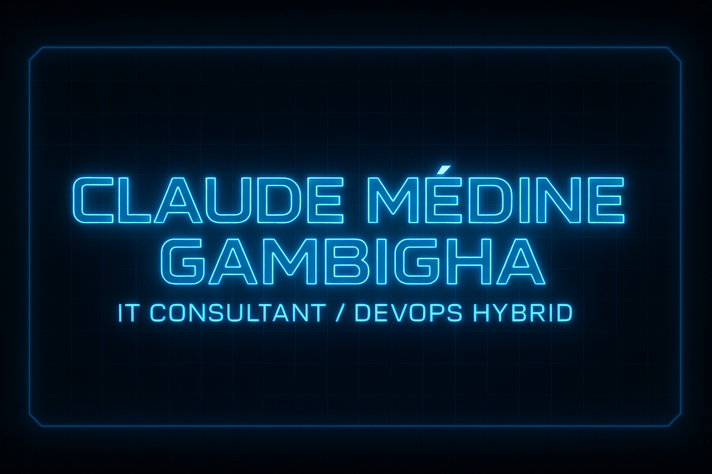

<!--───────────────────────────────────────────────────────────────-->
<h1 align="center">⚡ Claude Médine GAMBIGHA ⚡</h1>
<h3 align="center">IT Consultant Junior • DevOps Hybride • Cyber & Automation Engineer</h3>

  
  
  
  

<!--───────────────────────────────────────────────────────────────-->

> 💬 *"Je ne code pas seulement des outils. Je conçois des systèmes capables d’apprendre, de réagir et d’évoluer."*  

---

## 🧠 Profil & Vision

Je suis **Claude Médine GAMBIGHA**, un **architecte IT orienté DevSecOps & Automation**, combinant :

- 🖥 **Administration système Linux avancée**
- 🔐 **Cybersécurité opérationnelle & cryptographie appliquée**
- ⚙️ **Automatisation intelligente (n8n, CI/CD, scripting)**
- 🐳 **Conteneurisation & infrastructure modulaire**
- 📊 **Monitoring & analyse d’événements (SOC mindset)**

Je conçois des environnements techniques comme des **écosystèmes sécurisés et automatisés**,  
où chaque service est :

> **Observable • Automatisé • Sécurisé • Documenté**

---

## ⚡ Niveau & Progression

### 🔹 Niveau actuel : **8 / 10 – DevSecOps Engineer en progression**

💡 Ma montée en compétence est orientée vers :
- L’automatisation intelligente
- La sécurité by design
- La maîtrise des flux de données
- La cryptographie moderne

**XP Global :**

| Compétence 🧩 | XP actuel |
|---------------|-----------|
| **Linux / Serveurs** |  |
| **Réseau & Sécurité** |  |
| **Automatisation / DevOps** |  |
| **Cryptographie appliquée** |  |
| **SOC / Threat Analysis** |  |
| **Virtualisation & Containers** |  |
| **Langages / Web / API** |  |
| **Automatisation No-Code / Workflows (n8n)** |  |

> 🎯 Progression mesurée sur projets réels : déploiements, sécurisation, automatisation et implémentation crypto.

---

## 🧩 Stack & Expertise

### 🖥️ Systèmes / Réseaux
`Ubuntu Server` • `pfSense` • `Pi-hole` • `Samba` • `DNS/DHCP` • `Firewall` • `Reverse Proxy`

### ⚙️ DevOps & Automatisation
`Docker` • `Bash` • `Cron` • `GitHub Actions` • `CI/CD` • `Monitoring`  
`n8n (Workflows, Webhooks, API automation, orchestration)`  
`Infrastructure modulaire & scripting sécurisé`

### 🔐 Cryptographie & Sécurité

- `AES-256-GCM`
- `PBKDF2`
- `OpenSSL`
- `Hashing sécurisé`
- `Conception de coffre-fort numérique`
- `Gestion sécurisée des secrets`
- `Threat Modeling basique`
- `Sécurité by design`

### 🧠 Sécurité / SOC

`TryHackMe` • `HackTheBox` • `Glances` • `Atop`  
Analyse de logs • Corrélation d’événements • Simulation Blue Team  
Détection d’anomalies • Analyse d’incidents

### 💻 Développement & API

`Flask` • `Python` • `C (projets cryptographiques)`  
`HTML` • `CSS` • `JavaScript`  
`Stripe API` • `Webhooks` • `REST APIs`

---

## 🚀 Projets emblématiques

| 🛰 Projet | Description | Stack |
|-----------|-------------|--------|
| **SecureVault** | Coffre-fort numérique avec AES-256-GCM & PBKDF2 | C • OpenSSL • Linux |
| **SkyMonitor** | Monitoring système & réseau temps réel | Flask • InfluxDB • Grafana • Docker |
| **BlueSentinel (SOC Simulation)** | Analyse et corrélation d’incidents | Linux • SIEM mindset • Logs |
| **n8n Automation Lab** | Orchestration d’API, alerting, workflows sécurisés | n8n • Webhooks • Docker |
| **Pi-hole Homelab** | DNS filtering + gestion réseau | Pi-hole • Linux |
| **Docker Lab** | Environnement multi-conteneurs modulaire | Docker • Networking |

> 📘 Chaque projet est documenté avec architecture, logique de sécurité et principes d’implémentation.

---

## 🌌 Vision 2026+

> **Construire des infrastructures automatisées, sécurisées et intelligentes.**

Objectifs :

- 🔐 Développer une **suite open-source orientée sécurité & cryptographie**
- ⚙️ Créer une **plateforme d’automatisation sécurisée basée sur n8n**
- ☁️ Concevoir une architecture DevSecOps modulaire
- 🤖 Intégrer IA & détection d’anomalies dans le monitoring
- 🛰️ Faire évoluer Sky Blue Corporation vers un pôle d’innovation technologique

---

## 🧾 Identité Technique

🌍 GitHub → https://github.com/Claude7776  
💼 LinkedIn → Claude Médine GAMBIGHA  
🏢 Organisation → Sky Blue Corporation  
📡 Orientation → DevSecOps • Cryptographie • Automation Architect  

---

## 💬 Philosophie

> “La sécurité n’est pas une option. C’est une architecture.”  
> “Automatiser sans sécuriser, c’est accélérer le risque.”  

---

  

> 🧠 Tous les projets sont pensés avec une logique :  
> **Confidentialité • Intégrité • Disponibilité • Automatisation.**
