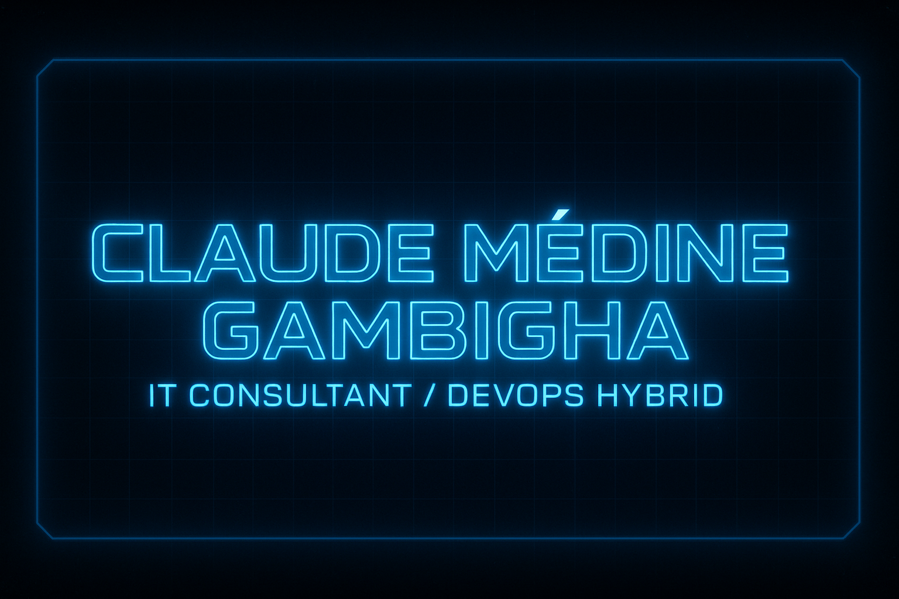

<!--───────────────────────────────────────────────────────────────-->
<h1 align="center">⚡ Claude Médine GAMBIGHA ⚡</h1>
<h3 align="center">IT Consultant Junior • DevOps Hybride • Cyber & Automation Engineer</h3>

  
  
  
  

<!--───────────────────────────────────────────────────────────────-->

> 💬 *"Je ne code pas seulement des outils. Je conçois des systèmes capables d’apprendre, de réagir et d’évoluer."*  

---

## 🧠 Profil & Vision

Je suis **Claude Médine GAMBIGHA**, un **architecte IT hybride** mêlant :
- **Administration système Linux**,  
- **Sécurité opérationnelle (SOC, SIEM, monitoring)**,  
- **Automatisation DevOps**,  
- Et une approche orientée **intelligence technologique**.

Je transforme les environnements techniques en **laboratoires d’innovation**, où chaque script, conteneur et service devient une **brique intelligente**.

---

## ⚡ Niveau & Progression

### 🔹 Niveau actuel : **7 / 10 – DevOps Junior Confirmé**
💡 Chaque projet est une brique qui fait évoluer mes compétences.

**XP Global :**

| Compétence 🧩 | XP actuel |
|---------------|-----------|
| **Linux / Serveurs** |  |
| **Réseau & Sécurité** |  |
| **Automatisation / DevOps** |  |
| **Cybersécurité / SOC / SIEM** |  |
| **Virtualisation & Containers** |  |
| **Langages / Web / API** |  |
| **Gestion & Documentation IT** |  |

> 🎯 Progression mesurée par la maîtrise réelle sur le terrain : serveurs, réseau, projets et sécurité.

---

## 🧩 Stack & Expertise

### 🖥️ Systèmes / Réseaux
`Ubuntu Server` • `pfSense` • `Pi-hole` • `Samba` • `Firewall` • `DNS/DHCP`

### ⚙️ DevOps & Automatisation
`Docker` • `Bash` • `Cron` • `GitHub Actions` • `CI/CD` • `Monitoring`  

### 🧠 Sécurité / SOC
`TryHackMe` • `HackTheBox` • `Glances` • `Atop` • `Threat Analysis` • `Blue Team`  

### 💻 Développement Web
`Flask` • `Python` • `HTML` • `CSS` • `JS` • `Stripe API`  

### 📡 CRM & Call Center
`Clicksip` • `VoxCRM` • `Vicibox (Predictive, Inbound, Record)`  

---

## 🚀 Projets emblématiques

| 🛰 Projet | Description | Stack |
|-----------|-------------|--------|
| **SkyMonitor** | Application de monitoring réseau et système temps réel | Flask • InfluxDB • Grafana • Docker |
| **BlueSentinel (SOC Simulation)** | Analyse d’incidents et corrélation de logs | Linux • SIEM • Threat Intel |
| **Pi-hole Homelab** | DNS filtering et gestion DHCP personnalisée | Pi-hole • Linux • Network Mgmt |
| **Proxy Squid Network Control** | Gestion des accès Web en entreprise | Squid • Firewall • Policy Control |
| **Vicibox Server** | Déploiement complet d’un call center prédictif | Vicibox • SIP • Asterisk |
| **Sky Blue Web** | Site vitrine hébergé sur serveur Ubuntu + HTTPS | HTML/CSS/JS • DNS • XAMPP |
| **Docker Lab** | Environnement multi-conteneurs d’apprentissage | Docker • Automation • Networking |

> 📘 Tous les projets incluent une documentation GitHub structurée, un déploiement automatisé et un README détaillé.

---

## 🌌 Vision 2026+

> **“Construire des systèmes intelligents, sûrs et auto-adaptatifs.”**

- 🔐 Développer une **suite complète de sécurité réseau** open source  
- ☁️ Mettre en place une **infrastructure DevSecOps modulaire**  
- 🤖 Intégrer **l’IA dans le monitoring et la détection d’anomalies**  
- 🛰️ Étendre **Sky Blue Corporation** en pôle d’innovation IT  

---

## 🧾 Liens & Identité

🌍 **GitHub** → [Claude7776](https://github.com/Claude7776)  
💼 **LinkedIn** → [Claude Médine GAMBIGHA](https://www.linkedin.com/in/claude-m%C3%A9dine-gambigha%F0%9F%91%BE%E2%9A%99%EF%B8%8F-5434b4332/)  
🏢 **Organisation** → Sky Blue Corporation 🩵  
📡 **Ambition** → Consultant IT global, bâtisseur d’écosystèmes technologiques hybrides.  

---

## 💬 Citations qui me guident

> “L’innovation ne naît pas du confort, mais de la curiosité.” 
> “Je ne cherche pas à faire comme les autres — je cherche à faire mieux.” 

---

  

> 🧠 *Tout ce dépôt GitHub est administré, documenté et versionné depuis un environnement Linux mobile (Termux).*  
> ⚡ *Une preuve que la technologie, quand elle est maîtrisée, n’a aucune limite.*
